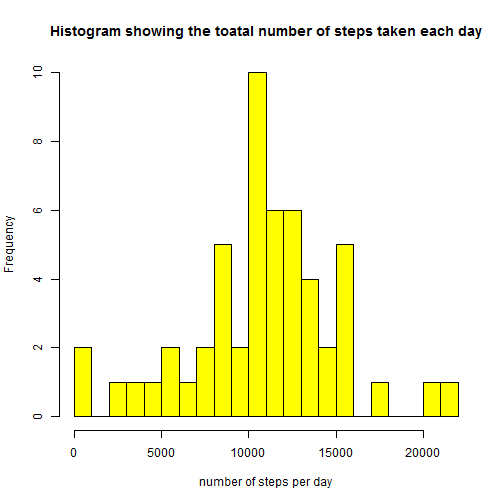
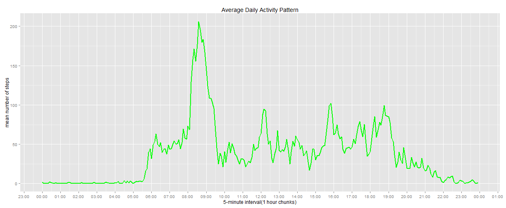
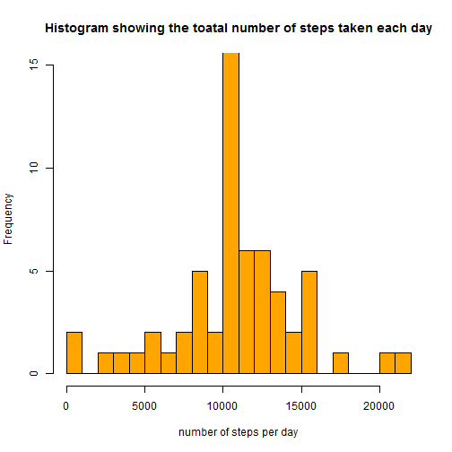
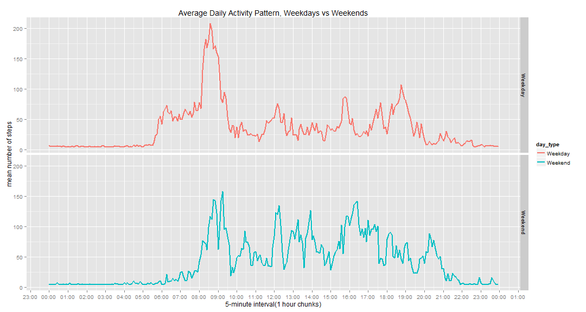

Reproducible Research: Peer Assessment 1
====================================================

###Introduction

It is now possible to collect a large amount of data about personal movement using activity monitoring devices such as a Fitbit, Nike Fuelband, or Jawbone Up. These type of devices are part of the "quantified self" movement -- a group of enthusiasts who take measurements about themselves regularly to improve their health, to find patterns in their behavior, or because they are tech geeks. But these data remain under-utilized both because the raw data are hard to obtain and there is a lack of statistical methods and software for processing and interpreting the data.

###Data
This assignment makes use of data from a personal activity monitoring device. This device collects data at 5 minute intervals through out the day. The data consists of two months of data from an anonymous individual collected during the months of October and November, 2012 and include the number of steps taken in 5 minute intervals each day.
Dataset: https://d396qusza40orc.cloudfront.net/repdata%2Fdata%2Factivity.zip
The variables included in this dataset are:
steps: Number of steps taking in a 5-minute interval (missing values are coded as NA)
date: The date on which the measurement was taken in YYYY-MM-DD format
interval: Identifier for the 5-minute interval in which measurement was taken
The dataset is stored in a comma-separated-value (CSV) file and there are a total of 17,568 observations in this dataset.

###load needed libraries

```r
library(dplyr)
library(ggplot2)
library(lubridate)
library(Hmisc)
```

###Loading and preprocessing the data

```r
#unzip and load data in to R
if (!file.exists("activity.csv")) {
  unzip("activity.zip") 
}
a.data <- read.csv("activity.csv",header=TRUE)
names(a.data)
```

```
## [1] "steps"    "date"     "interval"
```

```r
#convert date variable to date class
a.data$date <- as.Date(a.data$date)

#create a new variable 'time' and convert to a POSIXct class
a.data$time<-a.data$interval
a.data$time <- sprintf("%04d", a.data$time)
a.data$time <- as.POSIXct(strptime(a.data$time, format="%H%M"))

#create a weekday variable to be able to create a weekday - weekend demarcation in plots.
a.data$weekday<-wday(a.data$date, label = TRUE, abbr = FALSE)
head(a.data)
```

```
##   steps       date interval                time weekday
## 1    NA 2012-10-01        0 2015-07-20 00:00:00  Monday
## 2    NA 2012-10-01        5 2015-07-20 00:05:00  Monday
## 3    NA 2012-10-01       10 2015-07-20 00:10:00  Monday
## 4    NA 2012-10-01       15 2015-07-20 00:15:00  Monday
## 5    NA 2012-10-01       20 2015-07-20 00:20:00  Monday
## 6    NA 2012-10-01       25 2015-07-20 00:25:00  Monday
```

###What is mean total number of steps taken per day?
1.Calculate the total number of steps taken per day

```r
totalsteps <- aggregate(steps~date, a.data, sum, na.rm=TRUE)
head(totalsteps)
```

```
##         date steps
## 1 2012-10-02   126
## 2 2012-10-03 11352
## 3 2012-10-04 12116
## 4 2012-10-05 13294
## 5 2012-10-06 15420
## 6 2012-10-07 11015
```

2.Make a histogram of the total number of steps taken each day

```r
hist(totalsteps$steps, xlab="number of steps per day", 
     main="Histogram showing the toatal number of steps taken each day",
     breaks=25, col="yellow")
```

 

3.Calculate and report the mean and median of the total number of steps taken per day

```r
mean(totalsteps$steps)
```

```
## [1] 10766.19
```

```r
median(totalsteps$steps)
```

```
## [1] 10765
```


### What is the average daily activity pattern?
1)Make a time series plot of the 5-minute interval and the average number of steps taken, averaged across all days


```r
#compute the mean number of steps per day.
meansteps <- aggregate(steps~time, a.data, mean, na.rm=TRUE)
head(meansteps)
```

```
##                  time     steps
## 1 2015-07-20 00:00:00 1.7169811
## 2 2015-07-20 00:05:00 0.3396226
## 3 2015-07-20 00:10:00 0.1320755
## 4 2015-07-20 00:15:00 0.1509434
## 5 2015-07-20 00:20:00 0.0754717
## 6 2015-07-20 00:25:00 2.0943396
```

```r
#create plot
library(scales)
g<- ggplot(data= meansteps, aes(x=time, y=steps)) ## initial call to ggplot
g + geom_line(colour = "green", size= 1) + #add line layer(time series) +
scale_x_datetime(breaks= date_breaks("1 hour"),
labels = date_format("%H:%M")) +
 ggtitle("Average Daily Activity Pattern") +
#add title, x and y labels layer
  xlab("5-minute interval(1 hour chunks)") + 
  ylab("mean number of steps")
```

 

2)Which 5-minute interval, on average across all the days contains the maximum number of steps?

```r
max_interval <- which.max(meansteps$steps)
max_interval <- format(meansteps[max_interval,],format= "%H:%M")
max_interval
```

```
##      time    steps
## 104 08:35 206.1698
```
The 5_minute interval with the maximum number of steps is 08:35 with an average of 206.17 steps. 

##Imputing missing values

Calculate and report the total number of missing values in the dataset (i.e. the total number of rows with NAs)

```r
sum_NA <- sum(is.na(a.data$steps))
sum_NA
```

```
## [1] 2304
```
The total number of missing values in the dataset is 2304

2)Devise a strategy for filling in all of the missing values in the dataset.
-Create a new dataset that is equal to the original dataset but with the missing data filled in.
We will impute the missing values by filling in the mean of the steps in the 5 minute interval.

```r
#create new dataset and impute mean 5-minute interval value for NAs.
imputed_dt <- a.data
imputed_dt$steps <- with(imputed_dt, impute(steps, mean))
head(imputed_dt)
```

```
##     steps       date interval                time weekday
## 1 37.3826 2012-10-01        0 2015-07-20 00:00:00  Monday
## 2 37.3826 2012-10-01        5 2015-07-20 00:05:00  Monday
## 3 37.3826 2012-10-01       10 2015-07-20 00:10:00  Monday
## 4 37.3826 2012-10-01       15 2015-07-20 00:15:00  Monday
## 5 37.3826 2012-10-01       20 2015-07-20 00:20:00  Monday
## 6 37.3826 2012-10-01       25 2015-07-20 00:25:00  Monday
```

3)Make a histogram of the total number of steps taken each day. and Calculate and report the mean and median total number of steps taken per day. Do these values differ from the estimates from the first part of the assignment? What is the impact of imputing missing data on the estimates of the total daily number of steps?

```r
#calculate total number of steps per day with new dataset
tot_steps <- aggregate(steps~date,imputed_dt , sum)
head(tot_steps)
```

```
##         date    steps
## 1 2012-10-01 10766.19
## 2 2012-10-02   126.00
## 3 2012-10-03 11352.00
## 4 2012-10-04 12116.00
## 5 2012-10-05 13294.00
## 6 2012-10-06 15420.00
```

```r
#create histogram
hist(tot_steps$steps, xlab="number of steps per day", 
     main="Histogram showing the toatal number of steps taken each day",
     breaks=25, col="orange", ylim=c(0,15))
```

 

4)Calculate and report the mean and median total number of steps taken per day.
-Do these values differ from the estimates from the first part of the assignment?

```r
mean(tot_steps$steps)
```

```
## [1] 10766.19
```

```r
median(tot_steps$steps)
```

```
## [1] 10766.19
```
The mean of the original and new datasets remained the same while the median for the new dataset was slightly higher than the original.

##Are there differences in activity patterns between weekdays and weekends?

1)Create a new factor variable in the dataset with two levels - "weekday" and "weekend" indicating whether a given date is a weekday or weekend day.

```r
#convert the new dataset to a table class to use dplyr package
imputed_df <- tbl_df(imputed_dt)
imputed_df<- imputed_dt%>% 
  mutate(day_type = ifelse(weekday %in% c("Saturday", "Sunday"), "Weekend", "Weekday"))
head(imputed_df)
```

```
##     steps       date interval                time weekday day_type
## 1 37.3826 2012-10-01        0 2015-07-20 00:00:00  Monday  Weekday
## 2 37.3826 2012-10-01        5 2015-07-20 00:05:00  Monday  Weekday
## 3 37.3826 2012-10-01       10 2015-07-20 00:10:00  Monday  Weekday
## 4 37.3826 2012-10-01       15 2015-07-20 00:15:00  Monday  Weekday
## 5 37.3826 2012-10-01       20 2015-07-20 00:20:00  Monday  Weekday
## 6 37.3826 2012-10-01       25 2015-07-20 00:25:00  Monday  Weekday
```

```r
table(imputed_df$weekday, imputed_df$day_type)
```

```
##            
##             Weekday Weekend
##   Sunday          0    2304
##   Monday       2592       0
##   Tuesday      2592       0
##   Wednesday    2592       0
##   Thursday     2592       0
##   Friday       2592       0
##   Saturday        0    2304
```

2)Make a panel plot containing a time series plot (i.e. type = "l") of the 5-minute interval (x-axis) and the average number of steps taken, averaged across all weekday days or weekend days (y-axis). See the README file in the GitHub repository to see an example of what this plot should look like using simulated data.


```r
#compute average steps in each 5_minute interval by day type(ie. weekday/weekend)
step_daytype <- aggregate(steps ~ day_type + time, imputed_df, mean)
head(step_daytype)
```

```
##   day_type                time    steps
## 1  Weekday 2015-07-20 00:00:00 7.006569
## 2  Weekend 2015-07-20 00:00:00 4.672825
## 3  Weekday 2015-07-20 00:05:00 5.384347
## 4  Weekend 2015-07-20 00:05:00 4.672825
## 5  Weekday 2015-07-20 00:10:00 5.139902
## 6  Weekend 2015-07-20 00:10:00 4.672825
```

```r
#create plot
g<- ggplot(data= step_daytype, aes(x=time, y=steps, group = day_type, colour = day_type)) ## initial call to ggplot
g + geom_line(size=1) + #add line layer(time series) +
    facet_grid(day_type~.) +
scale_x_datetime(breaks= date_breaks("1 hour"),
labels = date_format("%H:%M")) +
 ggtitle("Average Daily Activity Pattern, Weekdays vs Weekends") +
#add title, x and y labels layer
  xlab("5-minute interval(1 hour chunks)") + 
  ylab("mean number of steps")
```

 


